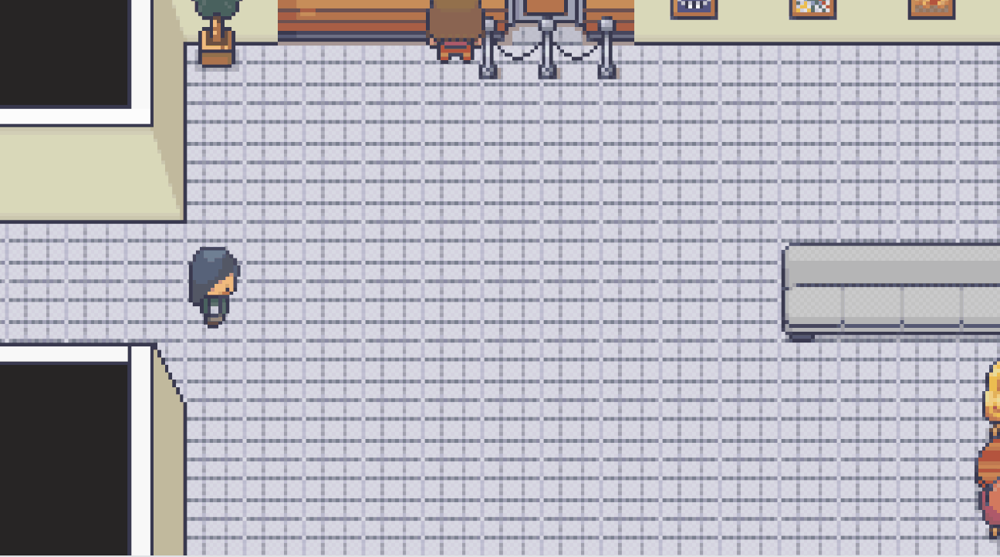
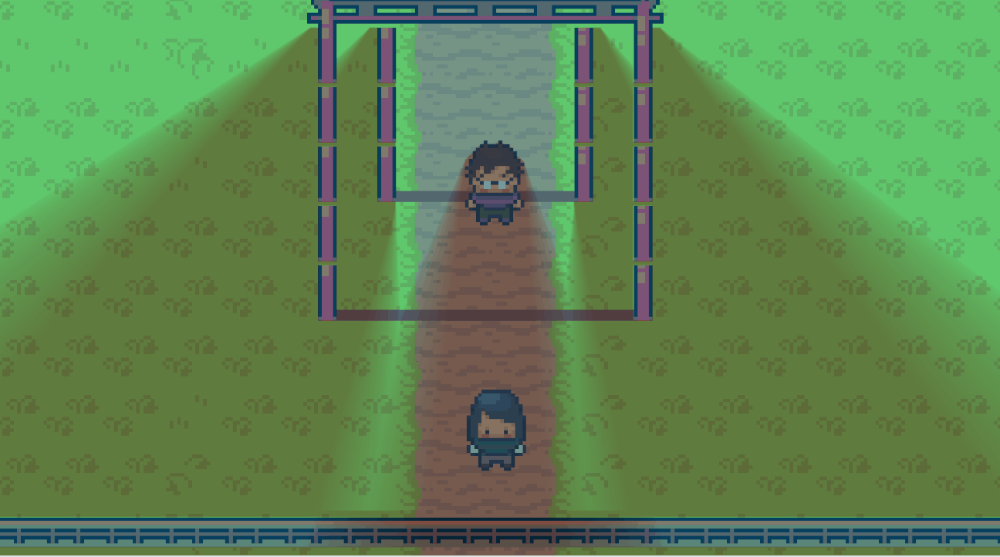
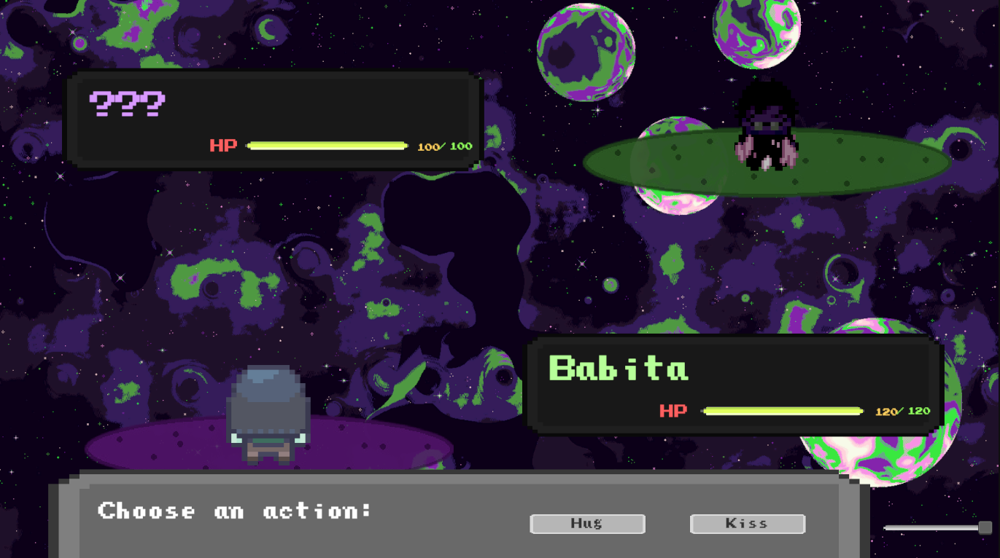

# Birthday Game (DEMO)

A top-down RPG with simple turn-based combat, made as a gift for my girlfriend's birthday in Unity 6.4.​ 

 Some of the levels were intentionally removed from the original project to make a public version of the game.
The original version was made for my girlfriend, so it's a bit personal. I still wanted to make a public version of that.

## Play in browser
https://tequila-sunset0.itch.io/birthday-game

## Screenshots
### Dialogue

### Menu

### Combat

## Credits

### Art

Modern Interiors - RPG Tileset [16X16] - https://limezu.itch.io/

[kulu] Zoo-Animals - https://itch.io/profile/kulurc

Free Dessert Icons - https://itch.io/profile/luminleveret

Animal Asset Pack [16x16] - https://itch.io/profile/deepdivegamestudio

Ninja Adventure - Asset Pack - https://pixel-boy.itch.io/ninja-adventure-asset-pack

UI User Interface Pack (Retro) - https://toffeecraft.itch.io/

Pixel Space Background Generator - https://itch.io/profile/deep-fold

### Music

The background music was made from some of our special songs. I took the MIDI files from Online Sequencer and converted them into chiptune using gxscc.

Online Sequencer - https://onlinesequencer.net/sequences

gxscc - https://gashisoft.web.fc2.com/E/index.html   
